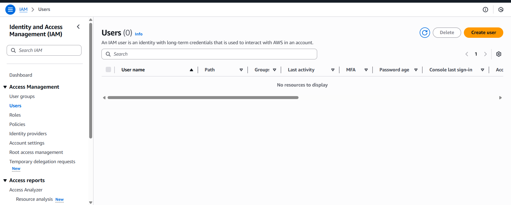
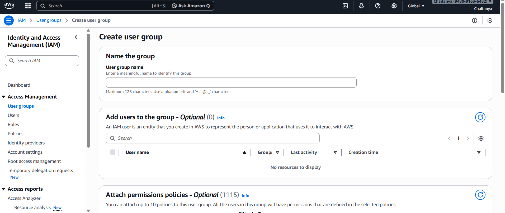

Perfect 🔥
Day 2 is VERY important. IAM is the backbone of AWS security.
This is where real DevOps thinking starts.

Below is your **professionally structured GitHub-ready Markdown file**.

You can copy this into:

```
Day-02-AWS-IAM.md
```

---

# 🚀 Day 02 – AWS IAM (Identity & Access Management)

## 📌 Overview

Today I learned about:

* What is AWS IAM?
* Why IAM is needed
* Authentication vs Authorization
* Root user vs IAM user
* IAM Components:

  * Users
  * Groups
  * Roles
  * Policies
* Practical: Created IAM user & group

---

# 🔐 What is AWS IAM?

**AWS IAM (Identity and Access Management)** is a service that allows you to:

> Securely control who can access AWS resources and what actions they can perform.

IAM handles:

* Authentication (Who are you?)
* Authorization (What can you do?)

IAM is a **Global Service** (not region-specific).

---

# 🤔 Why Do We Need IAM?

Without IAM:

* Everyone would use the root account
* No control over permissions
* High security risk
* No tracking of actions

IAM solves two major problems:

## 1️⃣ Authentication

Verifies identity:

* Username + Password
* Access Keys
* MFA

## 2️⃣ Authorization

Defines permissions:

* Can create EC2?
* Can delete S3 bucket?
* Can view billing?

> IAM enforces the Principle of Least Privilege.

---

# 👑 Root User vs IAM User

## Root User

* Created when AWS account is first created
* Has **full access** to everything
* Cannot be restricted
* Should NOT be used for daily tasks

Best Practice:

* Enable MFA
* Use only for billing & critical account settings

---

## IAM User

* Created inside AWS account
* Has specific permissions
* Used for daily operations
* Can be restricted using policies

> In production environments, teams NEVER use root. Only IAM users/roles.

---

# 🧱 Core Components of IAM

---

## 👤 1. Users

An IAM User represents:

* A person
* Or an application

Each user can have:

* Console password
* Access keys
* Attached policies

Example:

* DevUser
* AdminUser
* BackendAppUser

---

## 👥 2. Groups

A group is a collection of users.

Instead of assigning permissions individually:

* Attach policy to group
* Add users to group

Example:

* DevOps-Team
* Developers
* ReadOnlyUsers

Best Practice:

> Assign permissions to groups, not directly to users.

---

## 📜 3. Policies

Policies define permissions.

They are written in **JSON format**.

Example policy structure:

```json
{
  "Version": "2012-10-17",
  "Statement": [
    {
      "Effect": "Allow",
      "Action": "ec2:RunInstances",
      "Resource": "*"
    }
  ]
}
```

Types of Policies:

### ✅ AWS Managed Policies

Predefined by AWS
Example:

* AmazonEC2FullAccess
* AmazonS3FullAccess

### ✅ Customer Managed Policies

Custom policies created by us.

---

## 🎭 4. Roles

IAM Roles are used when:

* AWS services need permissions
* EC2 accessing S3
* Lambda accessing DynamoDB
* Cross-account access

Roles do NOT have passwords.

They are assumed temporarily.

> Roles are heavily used in DevOps & production setups.

---

# 🛠 Practical Implementation

---

## Step 1: Login with Root User

* Open AWS Console
* Login using root credentials

⚠ Best Practice: Root should only be used for setup.

---

## Step 2: Navigate to IAM

Go to:

AWS Console → IAM → Access Management → Users

📷 Example Screen:



---

## Step 3: Create New IAM User

* Click **Create User**
* Add:

  * Username
  * Console access (if required)
  * Set password

---

## Step 4: Attach Permissions

At this stage, we can:

### Option 1: Attach AWS Managed Policies

Example:

* AmazonEC2FullAccess
* AmazonS3FullAccess

### Option 2: Create Custom Policy (JSON)

For fine-grained control.

---

## Step 5: Login Using IAM User

Now instead of root:

* Use IAM user credentials
* Login using account ID / alias

---

# 👥 Creating IAM Group (Best Practice)

Instead of attaching policies directly to user:

### Steps:

1. Go to IAM → User Groups
2. Click Create Group
3. Attach required policies
4. Add users to that group

📷 Example Screen:



Now:

* If 10 developers join
* Just add them to Developers group
* No need to attach policies one by one

---

# 🧠 Real World DevOps Insight

In real companies:

* Root account is locked
* All engineers use IAM users
* Permissions are group-based
* Services use IAM Roles
* Strict least privilege model
* MFA is mandatory

IAM misconfiguration = Biggest security risk in cloud.

---

# ⚠ Common Mistakes Beginners Make

* Using root for everything ❌
* Giving FullAccess to all users ❌
* Not enabling MFA ❌
* Attaching policies directly to users ❌

---


