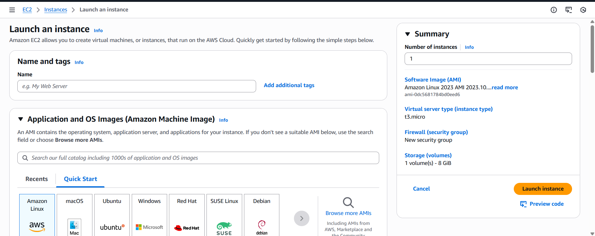
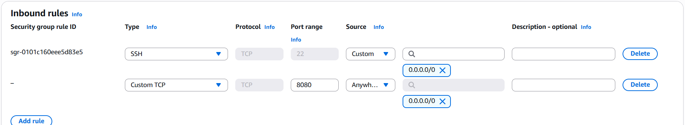
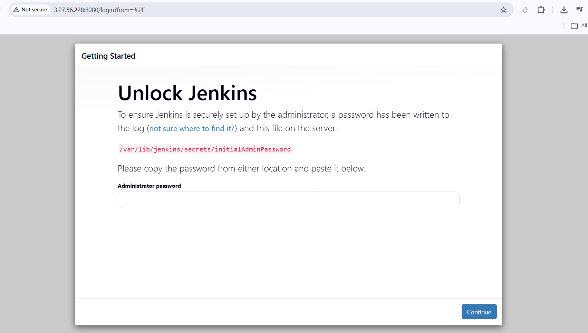

# 🚀 Day 03 – Amazon EC2 & Deploying Jenkins

## 📌 Overview

Today I learned and implemented:

* What is EC2?
* Meaning of Elastic, Cloud, Compute
* EC2 Pricing Model (Pay-as-you-go)
* Types of EC2 Instances
* Regions & Availability Zones
* Launching EC2 Instance
* SSH into EC2
* Installing Jenkins on EC2
* Configuring Security Groups

Today marks the official start of my DevOps hands-on journey 🔥

---

# ☁️ What is EC2?

**EC2 (Elastic Compute Cloud)** is one of the most popular AWS services.

It allows us to:

> Create virtual servers in the cloud.

These virtual servers are called **Instances**.

---

## 🧠 Breaking Down EC2

### 🔹 Elastic

You can:

* Scale up (increase CPU/RAM)
* Scale down
* Start/Stop anytime

Flexible resources.

---

### 🔹 Cloud

Runs on AWS global infrastructure.
No physical hardware ownership required.

---

### 🔹 Compute

Provides computational power:

* CPU
* RAM
* Network
* Storage

---

# 💰 Pricing Model

EC2 follows:

> Pay-As-You-Go Model

You only pay:

* For running time
* For storage used
* For data transfer

No upfront investment.

---

# 🏗 Types of EC2 Instances

## 1️⃣ General Purpose (Most Used)

Balanced CPU + Memory
Example: t2.micro, t3.micro

Use Case:

* Web servers
* Small applications

---

## 2️⃣ Compute Optimized

High CPU performance

Use Case:

* High-performance computing
* Gaming servers
* Batch processing

---

## 3️⃣ Memory Optimized

High RAM

Use Case:

* Databases
* Caching servers

---

## 4️⃣ Storage Optimized

High disk throughput

Use Case:

* Big data workloads
* Data warehousing

---

## 5️⃣ Accelerated Computing

Uses GPUs

Use Case:

* Machine learning
* AI workloads
* Video rendering

---

# 🌍 Regions & Availability Zones

## Region

A geographical area.

Example:

* Mumbai
* US-East-1
* London

---

## Availability Zone (AZ)

Each Region contains multiple AZs.

AZ =

* One or more data centers
* Isolated from other AZs
* Connected via high-speed network

> High availability is achieved using multiple AZs.

---

# 🛠 Practical Implementation

---

# Step 1: Launch EC2 Instance

Go to:

AWS Console → EC2 → Instances → Launch Instance

📷 Launch Instance Screen:



---

## Step 2: Select AMI (Operating System)

Choose:

* Ubuntu
* Amazon Linux
* Debian
* Windows

I selected Ubuntu.

---

## Step 3: Create Key Pair

### 🔑 What is a Key Pair?

A Key Pair consists of:

* Private Key (stored locally)
* Public Key (stored in EC2)

It is used for **secure SSH authentication**.

Instead of password login, AWS uses cryptographic key-based login.

Why needed?

* Secure login
* No password exposure
* Industry standard authentication

⚠ Important:
Private key must have proper permission:

```bash
chmod 400 your-key.pem
```

---

# 🎉 EC2 Instance Created

DevOps journey officially started 🚀

---

# 🔐 Connecting to EC2 via SSH

You need:

* SSH client

  * Linux/macOS → Built-in
  * Windows → MobaXterm / PowerShell

### SSH Command:

```bash
ssh -i path_of_your_key.pem ubuntu@public_ip
```

Example:

```bash
ssh -i mykey.pem ubuntu@3.27.56.228
```

If permission error:

```bash
chmod 400 mykey.pem
```

---

# 🚀 Deploying Jenkins on EC2

Now comes the real DevOps step 🔥

---

## Step 1: Update Packages

```bash
sudo apt update -y
```

---

## Step 2: Install Java (Required for Jenkins)

```bash
sudo apt install fontconfig openjdk-21-jre -y
```

Check Java:

```bash
java -version
```

---

## Step 3: Install Jenkins

Add Jenkins repository:

```bash
sudo wget -O /etc/apt/keyrings/jenkins-keyring.asc \
https://pkg.jenkins.io/debian-stable/jenkins.io-2026.key
```

Add Jenkins source:

```bash
echo "deb [signed-by=/etc/apt/keyrings/jenkins-keyring.asc]" \
https://pkg.jenkins.io/debian-stable binary/ | sudo tee \
/etc/apt/sources.list.d/jenkins.list > /dev/null
```

Update & Install:

```bash
sudo apt update
sudo apt install jenkins -y
```

---

## Step 4: Check Jenkins Status

```bash
sudo systemctl status jenkins
```

It must show:
active (running)

---

# 🌐 Access Jenkins via Browser

Open:

```
http://public_ip:8080
```

But initially it won’t work ❌

Why?

Because port 8080 is not open in Security Group.

---

# 🔥 Fix: Add Port 8080 in Security Group

Go to:

EC2 → Instance → Security → Security Groups → Edit Inbound Rules

Add:

* Type: Custom TCP
* Port: 8080
* Source: 0.0.0.0/0 (for learning purpose only)

📷 Security Group Configuration:



---

# 🎉 Jenkins Successfully Deployed

Now open:

```
http://public_ip:8080
```

You will see:

📷 Jenkins Unlock Page:



To unlock Jenkins:

```bash
sudo cat /var/lib/jenkins/secrets/initialAdminPassword
```

Copy password and paste in browser.

---

# 🧠 Real DevOps Insight

Today you learned:

* Infrastructure provisioning
* Secure access (SSH)
* Installing software on server
* Opening firewall ports
* Basic server management
* Deploying CI tool

This is exactly how DevOps engineers:

* Provision servers
* Install CI/CD tools
* Configure networking
* Manage infrastructure
