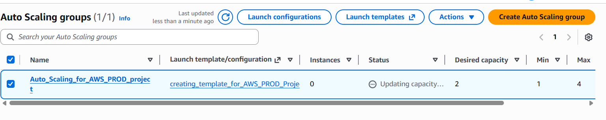

# 🚀 Day 7 – First Production-Level AWS Project

### Multi-AZ Architecture with Auto Scaling, Load Balancer & Bastion Host

---

# 🧠 Introduction – What We’re Building

This is our first **production-style AWS architecture**.

We will build:

* A custom **VPC**
* 2 Availability Zones
* Public & Private Subnets
* NAT Gateways
* Bastion Host
* Auto Scaling Group
* Application Load Balancer
* Application deployed in Private Subnets

---

# 📌 Before Starting – Core Concepts

---

## 🔁 Auto Scaling Group (ASG)

An **Auto Scaling Group** automatically manages EC2 instances.

It ensures:

* High availability
* Automatic scaling
* Self-healing infrastructure

If:

* 2 servers are not enough → It scales up
* Traffic decreases → It scales down
* One instance crashes → It replaces it automatically

This is critical in production systems.

---

## ⚖️ Load Balancer

A **Load Balancer** distributes incoming traffic across multiple servers.

Instead of users hitting one server:

```
User → Load Balancer → Multiple EC2 Instances
```

Benefits:

* Prevents overload
* High availability
* Fault tolerance
* Health checks

We will use:

👉 **Application Load Balancer (ALB)**

---

## 🔐 Bastion Host (Jump Server)

Our application servers are inside **Private Subnets**.

Private subnet = No public IP
So we cannot SSH directly.

Solution:

👉 Create a **Bastion Host** in Public Subnet.

Flow:

```
Local Machine → Bastion Host → Private EC2
```

This is secure production practice.

---

# 🏗 Architecture Overview

```
Internet
   ↓
Application Load Balancer (Public Subnet - AZ1 & AZ2)
   ↓
Auto Scaling Group (Private Subnets - AZ1 & AZ2)
   ↓
NAT Gateway (for outbound internet)
```

---

# ❓ Why Are We Creating 2 Availability Zones?

High Availability.

If one Availability Zone fails:

* The second zone keeps running
* Application stays available

Production systems NEVER rely on single AZ.

---

# ❓ Why Do We Need Subnets?

Subnets divide the VPC network.

We create:

### Public Subnets

* For Load Balancer
* For Bastion Host
* For NAT Gateway

### Private Subnets

* For Application servers
* More secure
* No direct internet access

This separation increases security.

---

# ❓ Why NAT Gateway in Public Subnet?

Private EC2 instances:

* Cannot access internet directly
* But they need:

  * OS updates
  * Package installation
  * External API calls

So traffic flows:

```
Private EC2 → NAT Gateway → Internet
```

NAT allows outbound internet but blocks inbound traffic.

---

# 🚀 Project Implementation

---

# ✅ Step 1 – Create VPC

Go to VPC → **Create VPC**

Select:

✔ VPC and more

This automatically creates:

* 2 Public Subnets (2 AZ)
* 2 Private Subnets (2 AZ)
* Internet Gateway
* NAT Gateways
* Route Tables

Click → Create VPC

---

# ✅ Step 2 – Create Launch Template

Go to EC2 → Launch Template

* Select Ubuntu AMI
* Select Free Tier instance
* Add key pair
* Create new Security Group
* Select your created VPC

Create Launch Template.

---

# ✅ Step 3 – Create Auto Scaling Group

Go to EC2 → Auto Scaling Groups

* Select created Launch Template
* Choose **Private Subnets only**
* Select both Availability Zones

Capacity configuration:

* Min = 1
* Desired = 2
* Max = 4

Create Auto Scaling Group.

---



After creation:

Check EC2 service → You should see:

* 2 instances
* In 2 different Availability Zones
* In Private Subnets

---

# 🔐 Step 4 – Create Bastion Host

We cannot SSH to private instances directly.

So:

* Create EC2 instance
* Place it in Public Subnet
* Attach public IP
* Attach proper Security Group (Allow SSH from your IP)
* Select same VPC

Now connect to Bastion Host.

---

# 📂 Copy .pem File to Bastion

From local machine:

```bash
scp -i "virginia_key_value_pair.pem" virginia_key_value_pair.pem ubuntu@<bastion-public-ip>:/home/ubuntu
```

Login to bastion:

```bash
ssh -i virginia_key_value_pair.pem ubuntu@<bastion-public-ip>
```

Verify key file exists.

---

# 🔐 Step 5 – Connect to Private EC2

From Bastion:

```bash
ssh -i virginia_key_value_pair.pem ubuntu@<private-ip>
```

Now you are inside private server.

---

# 🚀 Step 6 – Deploy Application

Inside private EC2:

```bash
sudo apt update
python3 -m http.server 8000
```

Run on both private instances separately.

---

# ⚖️ Step 7 – Create Application Load Balancer

Go to EC2 → Load Balancers → Create

Select:

✔ Application Load Balancer
✔ Internet-facing
✔ Select Public Subnets (Both AZs)

---

# 🎯 Create Target Group

* Target type → Instances
* Port → 8000
* Register both EC2 instances

Attach Target Group to Load Balancer.

---

# 🌐 Final Traffic Flow

User accesses:

```
http://<load-balancer-dns>
```

Traffic Flow:

```
User
   ↓
Internet
   ↓
Load Balancer (Public Subnets)
   ↓
Auto Scaling EC2 (Private Subnets)
```

If one instance fails:

* Load Balancer removes it
* ASG creates new one

That is production-grade architecture.

---

# 🔥 What You Built Today

* Multi-AZ Architecture
* Public/Private Subnet Isolation
* NAT Gateway configuration
* Bastion Host Access
* Auto Scaling Group
* Application Load Balancer
* High Availability System


